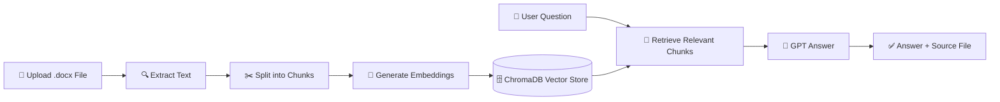

<div align="center">

# 📄✨ Chat with Your Word Document

### A clean, local **RAG chatbot** for asking questions about `.docx` files using **OpenAI, LangChain, ChromaDB, and Gradio**.

<br />


<br />

**Upload a Word document → index it → ask questions → get grounded answers with sources.**

</div>

---

## 🌟 Project Overview

**Chat with Your Word Document** is a lightweight Retrieval-Augmented Generation application that lets users upload a Microsoft Word file (`.docx`) and ask natural-language questions about its contents.

The app extracts text from the document, splits it into searchable chunks, creates vector embeddings, stores those vectors in ChromaDB, retrieves the most relevant chunks for every question, and then uses an OpenAI chat model to generate an answer based on the document context.

> [!NOTE]
> This project is ideal for learning how document chatbots work, testing a basic RAG pipeline, or building a foundation for a more advanced internal document assistant.

---

## 🖼️ Demo Flow



---

## 🚀 Key Features

| Feature | Description |
|---|---|
| 📤 **Word Upload** | Upload `.docx` files directly from the browser. |
| 🧩 **Automatic Chunking** | Splits long documents into smaller chunks for better retrieval. |
| 🧠 **OpenAI Embeddings** | Converts document chunks into vector representations. |
| 🗄️ **ChromaDB Search** | Stores and searches vectors locally during runtime. |
| 💬 **Conversational Q&A** | Ask follow-up questions with conversation memory. |
| 📚 **Source Display** | Adds the source document name to generated answers. |
| 🛠️ **Debug Output** | Prints retrieved chunks in the terminal for easy inspection. |
| ⚡ **Simple UI** | Uses Gradio for a clean local web interface. |

---

## 🧱 Tech Stack

<div align="center">

| Layer | Technology | Role |
|---|---|---|
| 🐍 Language | **Python** | Main application logic |
| 🖥️ Interface | **Gradio** | Local browser-based UI |
| 🧠 LLM | **OpenAI `gpt-4o-mini`** | Generates final answers |
| 🔢 Embeddings | **OpenAI `text-embedding-3-small`** | Converts text chunks into vectors |
| 🔗 RAG Framework | **LangChain** | Connects loader, splitter, retriever, memory, and LLM |
| 🗄️ Vector DB | **ChromaDB** | Stores and retrieves document embeddings |
| 📄 Loader | **docx2txt** | Extracts text from Word documents |
| 🔐 Config | **python-dotenv** | Loads the OpenAI API key from `.env` |

</div>

---

## 📁 Project Structure

```text
.
├── rag_word_bot.py      # Main Gradio + LangChain application
├── requirements.txt     # Python dependencies
├── .env                 # Local API key file - do not commit
└── README.md            # Project documentation
```

---

## ⚙️ Requirements

Before running the project, make sure you have:

- **Python 3.10+**
- An **OpenAI API key**
- A `.docx` file for testing
- Internet connection for OpenAI API requests

---

## 📦 Installation

### 1. Clone or download the project

```bash
git clone <your-repository-url>
cd <your-project-folder>
```

Or place these files in one local folder:

```text
rag_word_bot.py
requirements.txt
README.md
```

### 2. Create a virtual environment

#### macOS / Linux

```bash
python3 -m venv venv
source venv/bin/activate
```

#### Windows

```bash
python -m venv venv
venv\Scripts\activate
```

### 3. Install dependencies

```bash
pip install -r requirements.txt
```

---

## 🔐 Environment Variables

Create a file named `.env` in the project root:

```env
OPENAI_API_KEY=your_openai_api_key_here
```

> [!IMPORTANT]
> Never upload your `.env` file to GitHub. It contains your private API key.

Recommended `.gitignore`:

```gitignore
.env
venv/
__pycache__/
*.pyc
.chroma/
.DS_Store
```

---

## ▶️ Running the App

Run the app with:

```bash
python rag_word_bot.py
```

Gradio will start a local server and show a local URL similar to:

```text
http://127.0.0.1:7860
```

Open that URL in your browser, upload a `.docx` file, and start asking questions.

---

## 🧪 Example Questions

Try asking:

```text
What is this document about?
```

```text
Summarize the main points.
```

```text
What specific evidence, data, or examples support the main claims?
```

```text
Can you identify major risks, limitations, or challenges discussed in the document?
```

```text
Extract 3 obscure but interesting facts from deep inside the document.
```

---

## 🧠 How the RAG Pipeline Works

### 1. Upload

The user uploads a `.docx` file through the Gradio interface.

### 2. Load

`Docx2txtLoader` extracts the text from the Word document.

### 3. Split

`RecursiveCharacterTextSplitter` divides the document into chunks:

```python
chunk_size = 500
chunk_overlap = 50
```

### 4. Embed

Each chunk is converted into an embedding using:

```python
text-embedding-3-small
```

### 5. Store

The chunks and embeddings are stored in ChromaDB.

### 6. Retrieve

For every user question, the retriever returns the top matching chunks:

```python
k = 4
```

### 7. Generate

The retrieved chunks, question, and conversation history are sent to:

```python
gpt-4o-mini
```

The model generates a grounded answer based on the retrieved document context.

---

## 🧩 Core Code Architecture

| Function | Purpose |
|---|---|
| `load_and_index(file_path)` | Loads the Word file, splits text, creates embeddings, and builds the retriever. |
| `build_chain(retriever)` | Creates the LangChain conversational retrieval chain. |
| `upload_word(word_file)` | Handles file upload from Gradio and indexes the document. |
| `ask_question(question, history)` | Sends the question to the RAG chain and returns the chatbot response. |

---

## ✅ Expected User Flow

```text
1. Start the app
2. Open the local Gradio URL
3. Upload a .docx file
4. Wait for: ✅ Word document indexed!
5. Ask a question
6. Read the answer and source file name
7. Check terminal logs to inspect retrieved chunks
```

---

## 🛠️ Troubleshooting

### ❌ `OPENAI_API_KEY is not set`

Create a `.env` file in the project root:

```env
OPENAI_API_KEY=your_openai_api_key_here
```

Then restart the app.

---

### ❌ Upload fails or document is not indexed

Check that:

- The file is really a `.docx` file
- The file is not password-protected
- The file contains selectable text, not only scanned images
- All dependencies were installed successfully

---

### ❌ `ModuleNotFoundError`

Run:

```bash
pip install -r requirements.txt
```

Make sure your virtual environment is activated before installing.

---

### ❌ Gradio page opens but answers do not work

Check the terminal for the full error message. Common causes:

- Missing API key
- Invalid API key
- No internet connection
- OpenAI billing or quota issue
- Unsupported or corrupted Word file

---

## 🔒 Security Notes

> [!WARNING]
> This project sends document chunks to the OpenAI API. Do not upload sensitive, private, classified, medical, legal, financial, or confidential documents unless you understand the data-handling implications.

Recommended safety practices:

- Keep `.env` private
- Do not commit API keys
- Do not upload confidential documents during testing
- Add authentication before deploying publicly
- Add file-size limits before production use
- Review logs because retrieved chunks are printed in the terminal

---

## ⚠️ Current Limitations

| Limitation | Explanation |
|---|---|
| `.docx` only | The current app supports Word files, not PDF or TXT files. |
| In-memory vector store | ChromaDB is not persisted between app restarts. |
| Basic source display | Word files usually do not provide page numbers, so the app shows the source filename. |
| No authentication | Anyone with access to the local server can use the app. |
| API dependency | Answers require OpenAI API access. |

---

## 🧭 Future Improvements

- [ ] Add PDF support
- [ ] Add `.txt`, `.md`, and `.csv` support
- [ ] Persist ChromaDB locally
- [ ] Add source chunk previews in the UI
- [ ] Add page/section-level citations where available
- [ ] Add streaming responses
- [ ] Add better error messages in the Gradio interface
- [ ] Add Docker support
- [ ] Add authentication for deployment
- [ ] Add file-size and token-usage tracking
- [ ] Add multi-document chat support

---

## 🧪 Development Tips

During development, the app prints useful debug information to the terminal:

```text
QUESTION: user question
LLM ANSWER: generated answer
RETRIEVED CONTEXT CHUNKS: chunks used by the model
```

This is useful for checking whether the retriever is finding the correct parts of the document.

---

## 📌 Quick Start

```bash
# 1. Create virtual environment
python -m venv venv

# 2. Activate it
# Windows:
venv\Scripts\activate

# macOS/Linux:
source venv/bin/activate

# 3. Install dependencies
pip install -r requirements.txt

# 4. Add your API key to .env
OPENAI_API_KEY=your_openai_api_key_here

# 5. Run
python rag_word_bot.py
```

---

## 📄 License

This project is provided for educational and demonstration purposes.  
You may adapt it for personal or commercial use, but you are responsible for securing API keys, handling user data responsibly, and complying with all relevant service terms.

---

<div align="center">

### Built with ❤️ using Python, LangChain, OpenAI, ChromaDB, and Gradio

**Turn Word documents into interactive knowledge assistants.**

</div>
