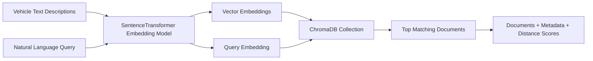

<div align="center">

# 🚗 Vector Database Semantic Search

### A lightweight ChromaDB project that demonstrates local embeddings, metadata storage, and semantic search over car descriptions.


**Build a small vector database, insert documents with metadata, and retrieve the most semantically relevant results using natural-language queries.**

</div>

---

## 🌟 Project Overview

This project demonstrates how a **vector database** can be used to search by meaning instead of exact keywords.

The script creates a local ChromaDB collection, embeds 15 short vehicle descriptions, attaches structured metadata such as brand, type, and year, and then runs semantic queries against the collection.

Unlike traditional keyword search, this project can match concepts even when the query does not use the same words as the stored document. For example, a query like **"zero emissions high tech transport"** can correctly point toward an electric vehicle description, even if the original text does not contain that exact sentence.

---

## 🎯 Main Goal

The goal of this mini-project is to understand the basic workflow behind modern semantic search systems:

```text
Text Data → Embeddings → Vector Database → Semantic Query → Relevant Results
```

This is the same core idea used in larger AI systems such as:

- RAG chatbots
- Document search engines
- Recommendation systems
- AI knowledge bases
- Internal company assistants

---

## 🧠 What This Project Demonstrates

| Concept | Description |
|---|---|
| **Embeddings** | Converts text into numerical vectors that represent meaning. |
| **Vector Database** | Stores embeddings and enables similarity search. |
| **Semantic Search** | Finds results based on meaning, not only exact words. |
| **Metadata Filtering Foundation** | Stores extra structured information like brand, vehicle type, and year. |
| **Distance Scores** | Uses vector distance to estimate how relevant each result is. |

---

## 🏗️ Architecture



---

## 🧩 How It Works

### 1. Load a Local Embedding Model

The project uses the `all-MiniLM-L6-v2` sentence-transformer model through ChromaDB's built-in embedding function.

This model runs locally, which means:

- No OpenAI API key is required
- No paid API usage is needed
- It can run directly on your machine
- The first run may take longer because the model needs to download

---

### 2. Create a ChromaDB Collection

The script creates a ChromaDB collection named:

```python
cars_collection
```

This collection stores the documents, metadata, and embeddings.

---

### 3. Add 15 Vehicle Documents

The dataset includes short descriptions of different vehicle categories, including:

- Sedan
- Muscle car
- Electric vehicle
- SUV
- Supercar
- Compact car
- Truck
- Luxury car
- Hybrid
- Sports car
- Minivan
- Classic car
- Hatchback

Each document also includes metadata:

```python
{
  "brand": "Tesla",
  "type": "EV",
  "year": 2012
}
```

---

### 4. Run Semantic Queries

The script runs five natural-language queries:

| Query | Intended Concept |
|---|---|
| `zero emissions high tech transport` | Electric vehicle |
| `saving money on gas during daily commutes` | Fuel efficiency / hybrid |
| `going fast on a racetrack with a loud exhaust` | Sports car / muscle car |
| `vehicles perfect for large families going on a trip` | Minivan |
| `carrying heavy construction materials` | Pickup truck |

For every query, the project returns the **top 2 most relevant results**.

---

## 📦 Project Structure

```text
vector-db-project/
│
├── vector-db.py        # Main Python script
├── README.md           # Project documentation
└── requirements.txt    # Python dependencies, optional but recommended
```

---

## ⚙️ Installation

### 1. Clone the Repository

```bash
git clone https://github.com/YOUR_USERNAME/YOUR_REPOSITORY_NAME.git
cd YOUR_REPOSITORY_NAME
```

### 2. Create a Virtual Environment

```bash
python -m venv .venv
```

Activate it:

#### macOS / Linux

```bash
source .venv/bin/activate
```

#### Windows

```bash
.venv\Scripts\activate
```

### 3. Install Dependencies

```bash
pip install chromadb sentence-transformers
```

Or, if you create a `requirements.txt` file:

```txt
chromadb>=0.5.0
sentence-transformers>=3.0.0
```

Then run:

```bash
pip install -r requirements.txt
```

---

## 🚀 How to Run

Run the script:

```bash
python vector-db.py
```

On the first run, the embedding model may take a few seconds or minutes to download.

---

## 🖥️ Example Output

The script prints the query, the retrieved documents, their metadata, and the vector distance score.

Example:

```text
🔎 Query: 'vehicles perfect for large families going on a trip'
--------------------------------------------------
Distance: 0.3934 | A family-friendly minivan with sliding doors, spacious seating for seven...
Metadata: {'brand': 'Honda', 'type': 'Minivan', 'year': 2015}
```

---

## 📏 Understanding Distance Scores

ChromaDB returns a distance score for each result.

In this project:

| Distance Range | Meaning |
|---|---|
| `0.00 - 0.50` | Very strong semantic match |
| `0.50 - 0.70` | Good conceptual match |
| `0.70+` | Weaker or potentially less relevant match |

A lower distance means the result is closer in meaning to the query.

---

## ✅ Key Findings

The project shows that semantic search can retrieve accurate results even when the query and the document do not share the same exact words.

For example, the query:

```text
going fast on a racetrack with a loud exhaust
```

can match documents about a Ferrari and an American muscle car because the embedding model understands related concepts such as performance, engine sound, and sports driving.

---

## 🧪 Why This Project Matters

This mini-project is important because it teaches the foundation of vector search, which is one of the most important parts of modern AI applications.

Before building a full RAG chatbot, it is useful to understand how documents are converted into embeddings and how a vector database retrieves the closest results.

This project is a clean beginner-friendly example of that process.

---

## 🛠️ Technologies Used

| Technology | Purpose |
|---|---|
| **Python** | Main programming language |
| **ChromaDB** | Vector database |
| **Sentence Transformers** | Local embedding model |
| **all-MiniLM-L6-v2** | Lightweight text embedding model |

---

## 🔐 Security Notes

This project does **not** require an API key.

That means:

- No `.env` file is required
- No OpenAI key is needed
- No private credentials should be committed to GitHub

Still, it is recommended to include a `.gitignore` file:

```gitignore
.venv/
__pycache__/
*.pyc
.DS_Store
```

---

## 🧯 Troubleshooting

### Problem: The model takes a long time to load

This is normal on the first run. The model is downloaded locally the first time it is used.

### Problem: `ModuleNotFoundError: No module named 'chromadb'`

Install ChromaDB:

```bash
pip install chromadb
```

### Problem: `ModuleNotFoundError: No module named 'sentence_transformers'`

Install Sentence Transformers:

```bash
pip install sentence-transformers
```

### Problem: Collection already exists

If you run the script in an environment where the same collection already exists, you may need to delete the old collection or use `get_or_create_collection()` instead of `create_collection()`.

Example:

```python
collection = client.get_or_create_collection(
    name="cars_collection",
    embedding_function=ef
)
```

---

## 🔮 Future Improvements

Possible next steps:

- Add metadata filtering by brand, type, or year
- Load documents from a CSV file instead of hardcoded lists
- Save ChromaDB data persistently to disk
- Add a Gradio interface
- Add user input instead of fixed queries
- Compare different embedding models
- Visualize embeddings in 2D using PCA or t-SNE
- Convert this into a small RAG application

---

## 📌 Summary

This project is a simple but powerful demonstration of how vector databases work.

It takes text descriptions, converts them into embeddings, stores them in ChromaDB, and retrieves semantically similar results using natural-language queries.

The project is especially useful as a foundation for understanding RAG systems, semantic search, and AI-powered document retrieval.

---

<div align="center">

### Built as part of an AI development learning path 🚀

</div>
