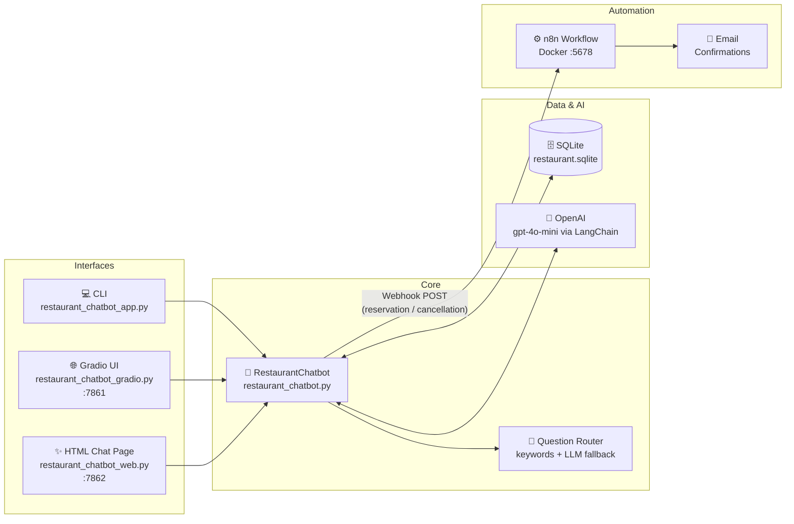
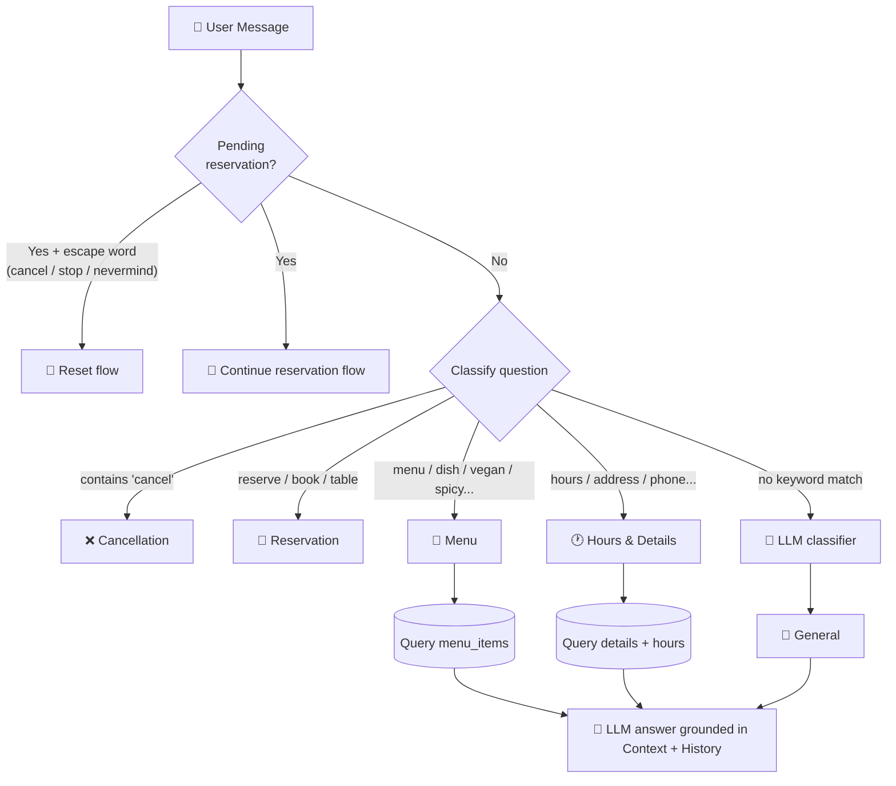
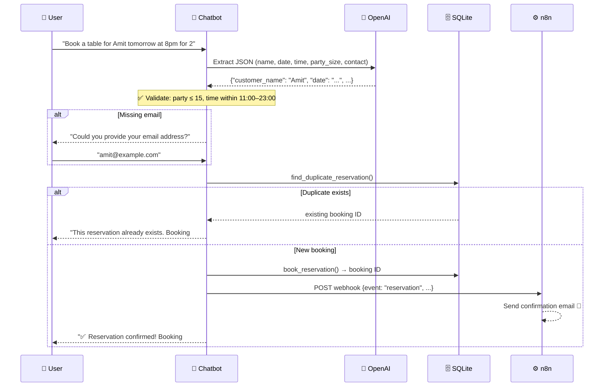
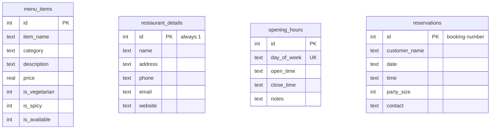
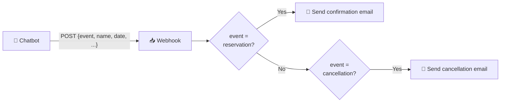

# 🍣 Sakura Asian Kitchen — Restaurant AI Agent

An AI-powered restaurant assistant built with **LangChain**, **OpenAI**, **SQLite**, and **n8n** automation.
The chatbot answers menu questions, provides restaurant details and opening hours, books and cancels table reservations, and triggers automated email confirmations through an n8n workflow.

> **Assignment 4** — Final Assignments · [AmitZalman/Final_Assignments](https://github.com/AmitZalman/Final_Assignments)

---

## 📋 Table of Contents

- [Features](#-features)
- [Architecture](#-architecture)
- [How It Works — Question Routing](#-how-it-works--question-routing)
- [Reservation Flow](#-reservation-flow)
- [Project Structure](#-project-structure)
- [Database Schema](#-database-schema)
- [Setup & Installation](#-setup--installation)
- [Running the App](#-running-the-app)
- [n8n Email Automation](#-n8n-email-automation)
- [Testing](#-testing)
- [Configuration Reference](#-configuration-reference)

---

## ✨ Features

| Feature | Description |
|---|---|
| 🍜 **Menu Q&A** | Search dishes by name, category, dietary needs (vegan/vegetarian, spicy, allergies) with synonym expansion |
| 🕐 **Restaurant Info** | Opening hours, address, phone, email, and website — served straight from SQLite |
| 📅 **Reservations** | Multi-turn booking flow that collects name, date, time, party size, and email across messages |
| ❌ **Cancellations** | Cancel by booking ID (`Cancel reservation #4`) or by customer name |
| 🛡️ **Validations** | Blocks parties over 15 guests, rejects times outside operating hours, prevents duplicate bookings |
| 🧠 **Conversation Memory** | Remembers previous dishes and orders; can calculate totals and tips from chat history |
| 📧 **n8n Automation** | Webhook-triggered email confirmations for reservations and cancellations |
| 💻 **3 Interfaces** | CLI, Gradio web UI, and a standalone elegant HTML chat page |
| 🔌 **Offline Fallback** | Works without an OpenAI key using keyword routing and direct DB answers |

---

## 🏗 Architecture



---

## 🔀 How It Works — Question Routing

Every user message is classified into one of five routes. Keyword matching runs first (fast and free); the LLM is used only when keywords can't decide.



---

## 📅 Reservation Flow

The booking flow collects details across multiple turns, validates them, prevents duplicates, and notifies n8n.



**Built-in edge-case handling:**

| Scenario | Behavior |
|---|---|
| Party size > 15 | Politely redirects to phone booking (`+1-555-0888`) |
| Time outside 11:00–23:00 | Rejects and shows operating hours |
| Missing details | Asks only for what's missing, keeps what was already given |
| Duplicate booking | Detected and blocked — returns the existing booking ID |
| User says "stop" / "nevermind" mid-flow | Booking flow is cancelled cleanly |
| n8n unreachable | Reservation is still saved locally — bot never crashes |

---

## 📁 Project Structure

```
Assignment-4_Restaurant-AI-Agent/
├── restaurant_chatbot.py           # 🤖 Core chatbot: routing, reservation & cancellation logic
├── restaurant_db.py                # 🗄️ SQLite schema, seed data, and query helpers
├── restaurant_chatbot_app.py       # 💻 CLI entrypoint
├── restaurant_chatbot_gradio.py    # 🌐 Gradio web UI (port 7861)
├── restaurant_chatbot_web.py       # ✨ Standalone HTML chat server (port 7862)
├── restaurant_chat.html            # 🎨 Elegant chat page served by the web server
├── smoke_test_restaurant_chatbot.py# ✅ Smoke & regression tests (no API credits needed)
├── Resturant_WorkFlow.json         # ⚙️ n8n workflow (import into n8n)
├── docker-compose.yml              # 🐳 Runs n8n locally
├── requirements.txt                # 📦 Python dependencies
└── restaurant.sqlite               # 🗄️ Pre-seeded database (auto-created if missing)
```

---

## 🗄 Database Schema



The database is seeded automatically on first run with **40 menu items** across 8 categories (Starters, Salads, Soups, Sushi, Noodles, Mains, Desserts, Drinks), restaurant details, and a full week of opening hours.

---

## 🚀 Setup & Installation

### Prerequisites

- Python **3.10+**
- An **OpenAI API key** (optional — the bot has a local fallback mode)
- **Docker** (only needed for the n8n email automation)

### Step 1 — Clone the repository

```bash
git clone https://github.com/AmitZalman/Final_Assignments.git
cd Final_Assignments/Assignment-4_Restaurant-AI-Agent
```

### Step 2 — Create a virtual environment

```bash
python -m venv venv

# Windows
venv\Scripts\activate

# macOS / Linux
source venv/bin/activate
```

### Step 3 — Install dependencies

```bash
pip install -r requirements.txt
```

### Step 4 — Configure environment variables

Create a `.env` file in the project folder:

```env
OPENAI_API_KEY=sk-your-key-here
LLM_MODEL=gpt-4o-mini
# Optional — only if using n8n email automation:
N8N_WEBHOOK_URL=http://localhost:5678/webhook/your-webhook-path
```

> 💡 **No API key?** The bot still works in local fallback mode — keyword routing with direct database answers (no LLM-generated text).

---

## ▶️ Running the App

Choose any of the three interfaces — they all share the same backend:

### Option A — CLI 💻

```bash
python restaurant_chatbot_app.py
```

### Option B — Gradio Web UI 🌐

```bash
python restaurant_chatbot_gradio.py
```

Open **http://localhost:7861**

### Option C — Elegant HTML Chat Page ✨

```bash
python restaurant_chatbot_web.py
```

Open **http://localhost:7862**

### 💬 Try These Prompts

```
What are your opening hours?
What spicy dishes are available?
Do you have dishes without peanuts?
Build me a full vegan course meal
Make a reservation for Amit tomorrow at 8pm for 2 people
How much is my order with a 10% tip?
Cancel reservation #1
```

---

## ⚙️ n8n Email Automation

The n8n workflow receives webhook events from the chatbot and sends confirmation emails for **reservations** and **cancellations**.



### Setup Steps

1. **Start n8n with Docker:**

   ```bash
   docker compose up -d
   ```

2. **Open the n8n editor:** http://localhost:5678

3. **Import the workflow:** Menu → *Import from File* → select `Resturant_WorkFlow.json`

4. **Configure email credentials** in the two *Send an Email* nodes (SMTP account).

5. **Activate the workflow** and copy the production webhook URL.

6. **Add the URL to `.env`:**

   ```env
   N8N_WEBHOOK_URL=http://localhost:5678/webhook/<your-webhook-path>
   ```

7. **Restart the chatbot** — every confirmed booking or cancellation now triggers an email. 📬

> 🛡️ If n8n is down, reservations are still saved to SQLite — the webhook call fails silently and is logged.

---

## ✅ Testing

Run the smoke & regression test suite (uses a temporary database and **zero API credits** — OpenAI is disabled during the test):

```bash
python smoke_test_restaurant_chatbot.py
```

Expected output:

```
smoke_test_restaurant_chatbot.py: PASS
```

**What's covered:**

| Test | Verifies |
|---|---|
| Database seeding | Menu items, restaurant details, all 7 days of hours |
| Menu routing | Vegetarian search, missing-item handling |
| Details routing | Opening hours + address responses |
| Reservation flow | Multi-turn booking, email collection, DB insert |
| Duplicate prevention | Identical booking is blocked, row count unchanged |
| Cancellation | Cancel by ID, missing-ID prompt, double-cancel handling |
| Classification | "Cancel" routes before "reservation"; tips/orders → general |

---

## 🔧 Configuration Reference

| Variable | Required | Default | Description |
|---|---|---|---|
| `OPENAI_API_KEY` | No* | — | OpenAI API key. Without it, the bot runs in local fallback mode |
| `LLM_MODEL` | No | `gpt-4o-mini` | Any OpenAI chat model name |
| `N8N_WEBHOOK_URL` | No | — | n8n webhook endpoint for email automation |

\* *Required for LLM-generated answers, reservation detail extraction, and course-meal recommendations.*

| Port | Service |
|---|---|
| `7861` | Gradio web UI |
| `7862` | Standalone HTML chat page |
| `5678` | n8n editor & webhook |

---

## 🛠 Tech Stack

**Python** · **LangChain** (`langchain-core`, `langchain-openai`) · **OpenAI GPT-4o-mini** · **SQLite** · **Gradio** · **n8n** · **Docker**

---

*Built by Amit Zalman — Assignment 4, Restaurant AI Agent.*
