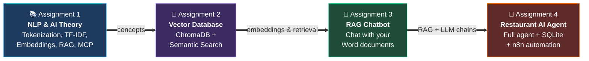
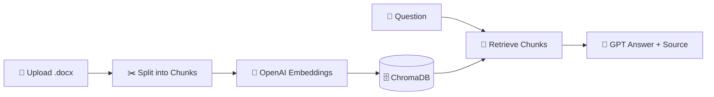
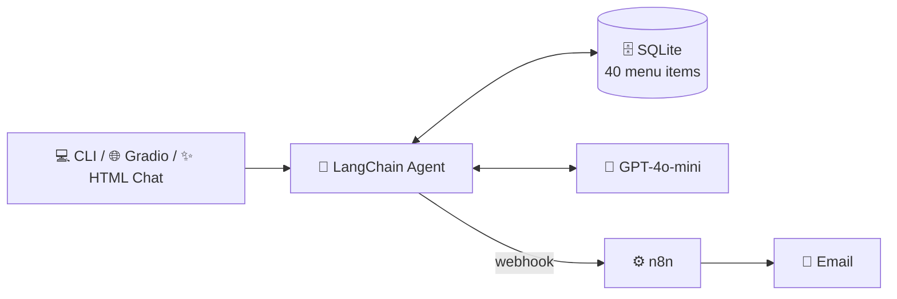
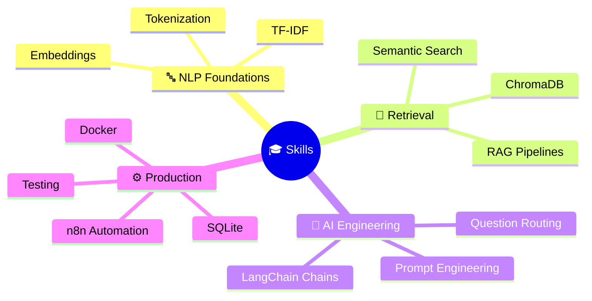

<div align="center">

<!-- Animated gradient wave header -->


<!-- Animated typing tagline -->


<br/><br/>

<!-- Tech stack badges -->


<br/>


<br/><br/>

**Four hands-on assignments that build on each other — starting with core NLP theory and ending with a complete, production-style AI agent.**

</div>


## 🗺️ The Learning Journey

Each assignment is one step in a progression — theory → embeddings → retrieval → autonomous agent:




## 📂 Assignments at a Glance

| # | Project | What It Does | Core Tech | Link |
|:-:|---|---|---|:-:|
| 1️⃣ | **📚 Theory Questions** | 12 clear Q&A explanations of NLP, RAG, Docker & AI-agent fundamentals | Markdown | [Open ➜](./Assignment-1_Theory%20Questions) |
| 2️⃣ | **🚗 Vector Database** | Semantic search over car descriptions — meaning, not keywords | ChromaDB · MiniLM Embeddings | [Open ➜](./Assignment-2_Vector-Database) |
| 3️⃣ | **📄 RAG Chatbot for Word** | Upload a `.docx`, ask questions, get grounded answers with sources | LangChain · OpenAI · ChromaDB · Gradio | [Open ➜](./Assignment-3_RAG_ChatBot-Word) |
| 4️⃣ | **🍣 Restaurant AI Agent** | Full agent: menu Q&A, reservations, cancellations & email automation | LangChain · OpenAI · SQLite · n8n · Docker | [Open ➜](./Assignment-4_Restaurant-AI-Agent) |


## 🔍 Explore Each Assignment

<!-- Interactive collapsible sections — click to expand! -->

<details>
<summary><h3>1️⃣ 📚 Theory Questions — NLP, RAG, Docker & AI Agents</h3></summary>

<br/>

Clear, example-driven answers to **12 fundamental questions**, including:

| Topic Area | Questions Covered |
|---|---|
| 🔤 **NLP Basics** | Tokenization · Stemming vs. Lemmatization · TF-IDF |
| 🧠 **Embeddings** | Sentence embeddings · Cosine similarity · Why `LIKE '%pizza%'` can't do semantic search |
| 📚 **RAG** | The problem RAG solves · Main steps of a RAG pipeline |
| 🐳 **Infrastructure** | Docker image vs. container |
| 🤖 **Agents** | AI agents with tools vs. simple chatbots · MCP · Agent Skills |

Every answer includes concrete examples — like how `better` → `good` in lemmatization but stays `better` in stemming.

**➜ [Read the full Q&A](./Assignment-1_Theory%20Questions)**

</details>

<details>
<summary><h3>2️⃣ 🚗 Vector Database — Semantic Search with ChromaDB</h3></summary>

<br/>

A lightweight project proving that **search by meaning beats search by keywords**:

```text
Text Data → Embeddings → Vector Database → Semantic Query → Relevant Results
```

- 🚙 Embeds **15 vehicle descriptions** with local `all-MiniLM-L6-v2` embeddings — **no API key needed**
- 🏷️ Attaches structured metadata (brand, type, year)
- 🔎 Runs natural-language queries like *"zero emissions high tech transport"* → correctly finds the electric car
- 📏 Ranks results by vector distance scores

**➜ [Explore the project](./Assignment-2_Vector-Database)**

</details>

<details>
<summary><h3>3️⃣ 📄 RAG Chatbot — Chat with Your Word Documents</h3></summary>

<br/>

**Upload a Word document → index it → ask questions → get grounded answers with sources.**



- 📤 Upload `.docx` files directly in the browser (Gradio UI)
- 🧩 Automatic chunking for better retrieval
- 💬 Conversational Q&A with memory for follow-up questions
- 📚 Every answer cites its source document

**➜ [Explore the project](./Assignment-3_RAG_ChatBot-Word)**

</details>

<details>
<summary><h3>4️⃣ 🍣 Restaurant AI Agent — The Grand Finale</h3></summary>

<br/>

A complete AI agent for **Sakura Asian Kitchen** — the most advanced project in the repo:



- 🍜 **Menu Q&A** — dietary filters, allergies, full-course recommendations, tip calculations
- 📅 **Smart reservations** — multi-turn detail collection, validations (party ≤ 15, operating hours), duplicate prevention
- ❌ **Cancellations** — by booking ID or customer name
- 📧 **n8n email automation** — Dockerized workflow sends confirmation emails
- ✅ **Smoke tests** — full regression suite that costs zero API credits
- 💻 **3 interfaces** sharing one backend: CLI, Gradio, and a custom HTML chat page

**➜ [Explore the project](./Assignment-4_Restaurant-AI-Agent)**

</details>


## 🛠️ Skills Demonstrated



| Category | Skills |
|---|---|
| 🧠 **AI / LLM** | Prompt engineering, LLM routing, structured JSON extraction, conversation memory, grounded answering |
| 🔎 **Retrieval** | Embeddings, vector databases, semantic search, chunking, RAG pipelines |
| 🏗️ **Engineering** | Python, SQLite schema design, REST webhooks, multi-interface architecture, error handling |
| 🚀 **DevOps & QA** | Docker Compose, n8n workflow automation, smoke & regression testing, environment configuration |


## ⚡ Quick Start

```bash
# Clone the repository
git clone https://github.com/AmitZalman/Final_Assignments.git
cd Final_Assignments

# Each assignment is self-contained — pick one and dive in:
cd Assignment-4_Restaurant-AI-Agent
pip install -r requirements.txt
python restaurant_chatbot_app.py
```

> 💡 Each assignment folder contains its own detailed README with full setup steps, architecture charts, and usage examples.

---

<div align="center">

### 👨‍💻 Built by Amit Zalman

*From theory to a working AI agent — one assignment at a time.*

<br/>

<!-- Animated wave footer -->


</div>
